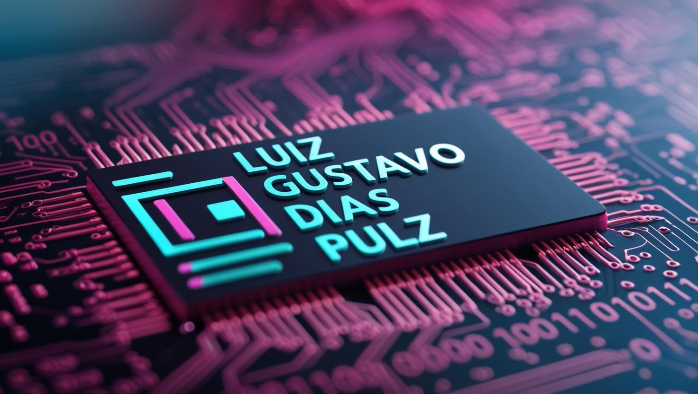

  

  

  <h1>👋 Olá, eu sou Luiz Gustavo 

  
  
  

  </h1>

  ### 🚀 Sobre mim

  

    🎓 Estudante de Desenvolvimento de Sistemas no Senac    
    💼 Trabalhando como Freelancer e Auxiliar de Laboratório 
    👨🏻‍💻 Aprendendo mais sobre APIs e Desenvolvimento Web   
    💡 Explorando novas tecnologias e desenvolvendo soluções de software 
    
 

  <h2></h2>

  ### 💻 Minhas Skills

  | Front-end | Back-end | Data-Base | Frameworks |
  |:-:|:-:|:-:|:-:|
  |  |  |  |  |
  |  |  |  |  |
  |  |  |  |  |
  |  |  | 
  | |  |

  ### 🔧Ferramentas e Utilidades⚙️

  
  
  

  
  
  

  
  
  

  
  
  

  
  
  

  <h2></h2>

  ### 🎯 Projetos em destaque

  
  
  
  
  
  

  <h2></h2>

  ### 📈 GitHub Stats

  
  

  <h2></h2>

  ### 📫 Onde me encontrar

  
  
   
  

