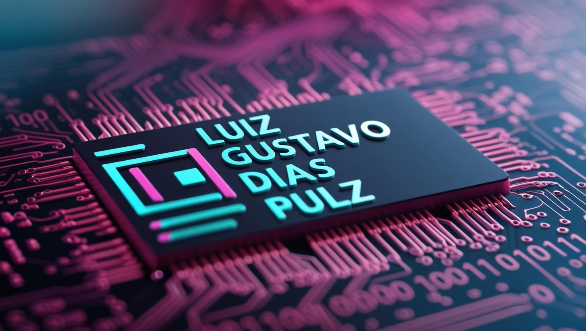

    

## 🚀 Sobre mim

- 🤔 Explorando novas tecnologias e desenvolvendo soluções de software.
- 🎓 Estudando Desenvolvimento de Sistemas no Senac.
- 💼 Trabalhando como Freelancer e Auxiliar de Laboratório.
- 🌱 Aprendendo mais sobre APIs e Desenvolvimento Web.

## 💻 Minhas Skills

| Front-end | Back-end | Data-Base | Frameworks |
|:-:|:-:|:-:|:-:|
|  |  |  |  |
|  |  |  |  |
|  |  |  |  |
|  |  |  |  |

### **Ferramentas e Utilidades**

## 🎯 Featured Projects

## 📈 GitHub Stats

## 📫 Onde me encontrar

